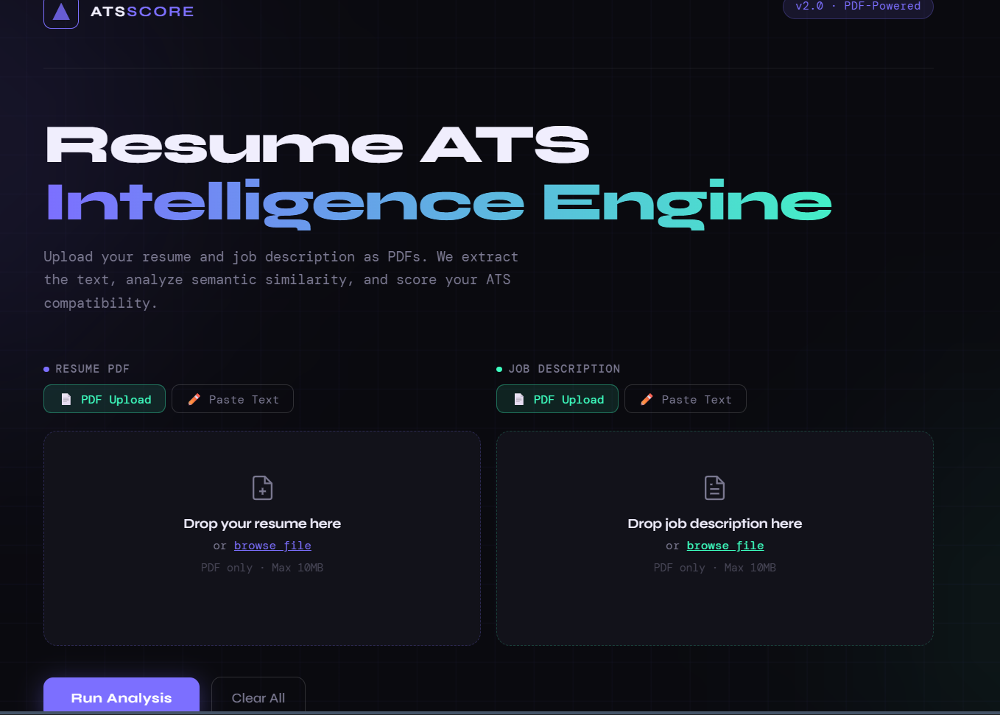
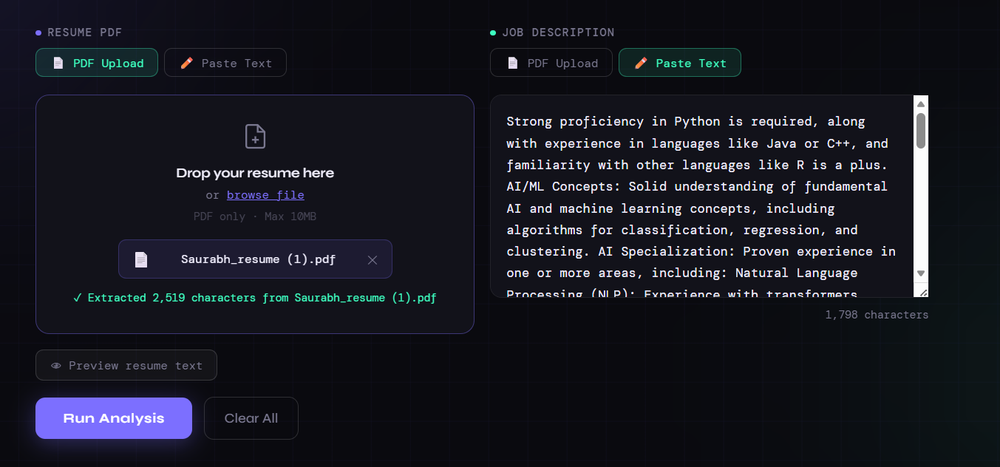
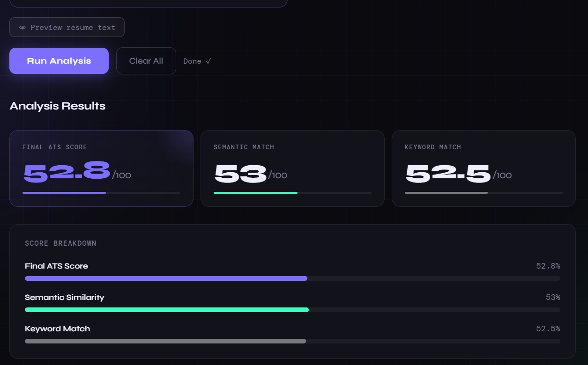
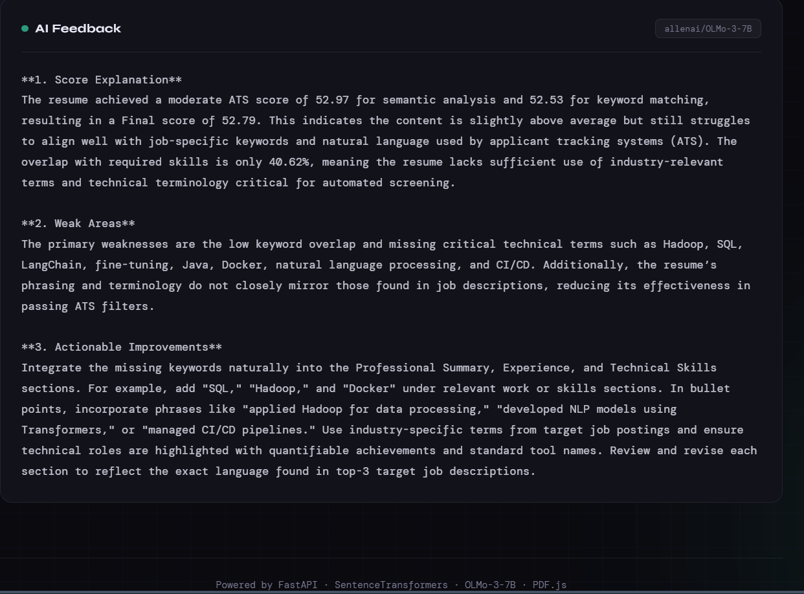

# 🚀 ATS Resume Matcher

<p align="center">
  <b>An AI-powered Applicant Tracking System that scores resumes against job descriptions using semantic similarity.</b><br>
  Built with FastAPI, served via Nginx, and containerized using Docker.
</p>

<p align="center">
  
  
  
  
</p>

---

## 🖼️ Preview

<p align="center">
  
  
</p>

<p align="center">
  
  
</p>

> Replace these image paths with your actual screenshots.

---

## ✨ Features

* 📄 Upload resume & job description (PDF or text)
* 🔍 Extract text using PyMuPDF
* 🧠 Semantic similarity via Sentence Transformers
* 🏷️ Keyword matching for skill overlap
* 📊 Final ATS score with summary
* ⚡ REST API built with FastAPI
* 🐳 Fully Dockerized for deployment

---

## 🧰 Tech Stack

| Layer            | Technology                          |
| ---------------- | ----------------------------------- |
| Backend          | FastAPI, Uvicorn                    |
| ML / Embeddings  | Sentence Transformers, Scikit-learn |
| PDF Parsing      | PyMuPDF                             |
| Frontend         | HTML/JS (served via Nginx)          |
| Containerization | Docker, Docker Compose              |
| Model Hub        | HuggingFace Hub                     |

---

## 📁 Project Structure

```
.
├── main.py
├── routes.py
├── schemas.py
├── services/
│   └── scorer.py
├── utilities/
│   ├── pdf_parser.py
│   └── keyword_match.py
├── requirements.txt
├── docker-compose.yml
├── Dockerfile
├── frontend/
└── nginx.conf
```

---

## ⚙️ Getting Started

### 📌 Prerequisites

* Docker & Docker Compose
* HuggingFace API Token

---

### 1️⃣ Clone Repository

```bash
git clone https://github.com/Saurabh-004/ATS_Intelligence_Engine
cd ats-resume-matcher
```

---

### 2️⃣ Setup Environment Variables

Create a `.env` file:

```env
HF_TOKEN=your_huggingface_token_here
```

---

### 3️⃣ Run with Docker

```bash
docker compose up --build
```

* Backend → http://localhost:8000
* Frontend → http://localhost:80

---

## 🔌 API Endpoints

### POST /predict/ats — JSON Input

```json
{
  "resume_text": "...",
  "job_description": "..."
}
```

---

### POST /predict/ats/upload — Multipart/Form-Data

| Field           | Type   | Description          |
| --------------- | ------ | -------------------- |
| resume_pdf      | File   | Resume PDF           |
| resume_text     | string | Resume text          |
| jd_pdf          | File   | Job description PDF  |
| job_description | string | Job description text |

> Provide at least one resume input and one JD input.

---

### 📤 Response

```json
{
  "semantic_score": 0.82,
  "keyword_score": 0.74,
  "final_ats_score": 0.79,
  "summary": "..."
}
```

---

## 🧠 How It Works

1. Extract text (PDF or raw input)
2. Clean & normalize text
3. Compute semantic similarity (cosine similarity)
4. Compute keyword overlap
5. Combine both scores → Final ATS score
6. Generate summary

---

## 💻 Development (Without Docker)

```bash
pip install -r requirements.txt
uvicorn main:app --reload --port 8000
```

---

## 🔐 Environment Variables

| Variable | Description           |
| -------- | --------------------- |
| HF_TOKEN | HuggingFace API token |

---

## 📜 License

MIT License — use it, modify it, just don’t act surprised if your model judges your resume harder than recruiters do.
